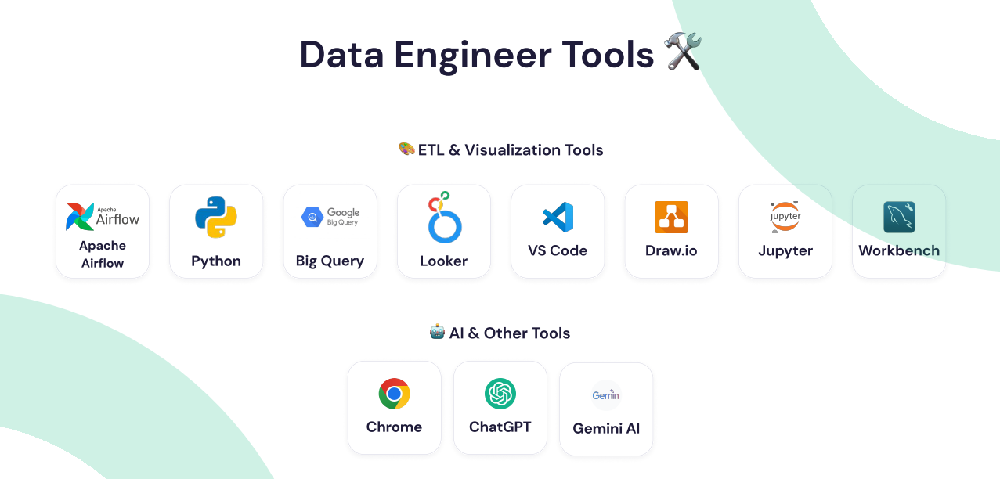

# Project Name
ETL Pipelines and Data Visualization for Plantopia with Theme "Agriculture"

# About Project
Plantopia is an innovative agriculture application designed to help users efficiently grow and care for their plants. The application is available on two platforms: a website for admin use and a mobile app for end users. This comprehensive project involved collaborative efforts from various teams, including UI/UX, Mobile Flutter, Front End ReactJS, Backend, Data Engineering, and Quality Engineering. In the Data Engineering division, I was responsible for developing ETL pipelines, automating them using Apache Airflow, and performing data visualization for further analysis. This project, focused on agriculture, was a fantastic learning experience at Alterra Academy as part of the MSIB Studi Independen Batch 6.

# Our Team Data Engineer

## Meet Our Team in LinkedIn
| Name | University | Contact |
|------|------------|---------|
| Nuri Hidayatuloh | Universitas Trunojoyo Madura | https://www.linkedin.com/in/nuri-hidayatuloh |
| Ayu Puspita | Universitas Negeri Malang | https://www.linkedin.com/in/ayupuspita9 |
| Alfina Salsabilla | Politeknik Negeri Malang | https://www.linkedin.com/in/alfina-salsabilla-127496242 |

 

# Tech Stacks
## Tools:

## Framework

# High Level Architecture (HLA) or Architecture Diagram ETL

This diagram represents a high-level architecture (HLA) for a data pipeline using Prefect for workflow orchestration, Python for data transformation, Google Cloud SQL as the data source, Google BigQuery as the data warehouse, and Looker Studio for visualization. This ETL (Extract, Transform, Load) process is automated using Apache Airflow. The diagram illustrates the following steps:

1. **Extract**
   - **Source**: MySQL database
   - **Action**: Data is extracted from the MySQL database.
   
2. **Transform**
   - **Tool**: Python
   - **Action**: The extracted data is transformed using Python scripts. This transformation can include cleaning, filtering, aggregating, and other data processing tasks.

3. **Load**
   - **Destination**: Google BigQuery
   - **Action**: The transformed data is loaded into Google BigQuery, a scalable and fully-managed data warehouse.

4. **Visualization**
   - **Tool**: Looker Studio
   - **Action**: The data stored in Google BigQuery is visualized using Looker Studio. This allows for creating interactive dashboards and reports for data analysis.

## Key Components

- **Apache Airflow**: Used to orchestrate and automate the ETL pipeline.
- **MySQL**: The source database from which data is extracted.
- **Python**: Used for transforming the data.
- **Google BigQuery**: The destination where the transformed data is loaded.
- **Looker Studio**: Used for visualizing the data stored in Google BigQuery.

This setup ensures a streamlined data pipeline from extraction to visualization, facilitating efficient data processing and analysis.

# Schema Data Warehouse

[Schema Data Warehouse](https://app.diagrams.net/#G1A14j-nEIBLNqmhLqm0ZHuYhalLnBdVhG#%7B%22pageId%22%3A%22MV9t8d0PRzWtROZZ8rIv%22%7D)

# Dashboard Visualization

_page-0001 1.png>)
-2 1.png>)
[Dashboard Visualization Data Engineer](https://lookerstudio.google.com/u/0/reporting/8d77fc22-60bc-4c8a-b47e-d7c408311cda/page/p_zv78knrhid)

# Setting Up Our Project
## Set Up Apache Airflow in Windows Subsytems for Linux (WSL)
- Download Ubuntu in Miscrosoft Store if you're currently not Installed this Application/Software. It's Free for all!
- After that, You can visit this Link [How to Install and Set Up Apache Airflow in WSL](https://www.google.com/url?sa=t&rct=j&q=&esrc=s&source=web&cd=&cad=rja&uact=8&ved=2ahUKEwjFtNqIvv6GAxVX6jgGHateD9cQFnoECBsQAQ&url=https%3A%2F%2Fwww.freecodecamp.org%2Fnews%2Finstall-apache-airflow-on-windows-without-docker%2F&usg=AOvVaw38lAELgfoqHAmN-WNDdYfI&opi=89978449) to setting up your Apache Airflow in WSL
- If the previous steps are done. Your Apache Airflow is Ready to use.

## Clone this Project to Apache Airflow Folder
- Clone this Repository to Folder Airflow 
- Open this Project (Apache Airflow) in Visual Studio Code

## Setting Up Enviroment Variabel & Project
- Prepare the ENV ex: user, password, database, servcie account, etc. 
- Move this file [DAGS_Pipelines-ETL](dags/ETL_Capstone-Project-Plantopia.py) to folder dags Apache Airflow.
- Adjust the code according to your needs.

## Running this Pipeline ETL using Apache Airflow in WSL
- Run this project
- Open in Localhost
- Ensure that the extracted, transformed, and loaded (ETL) data is as expected by running appropriate tests.
- if the task is running and done. Then, this Pipeline ETL is succesfully Develop!